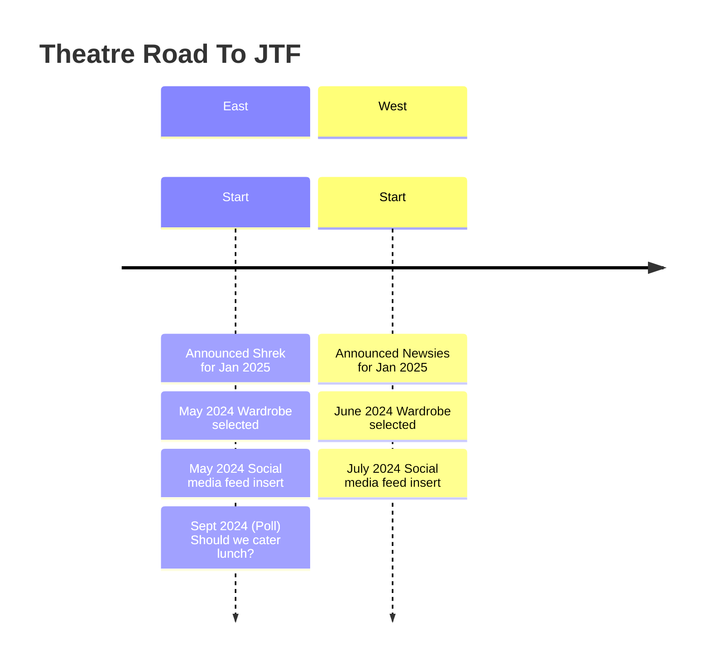

# Theatre Road to ...
## Why
As a niche project, this can provide anticipation, clarity, and a good-hearted place to deliver a path from start to event.

## Goals
Provide a simple timeline webpage with polls and feeds along the way. It will show the progress from one point to the event while gathering information from participants.

Maybe even build a little energy as the year moves along toward the event. 😊

# Simpliefied Idea

Overall, this concept should be continuous, applying to both the current event and future events.